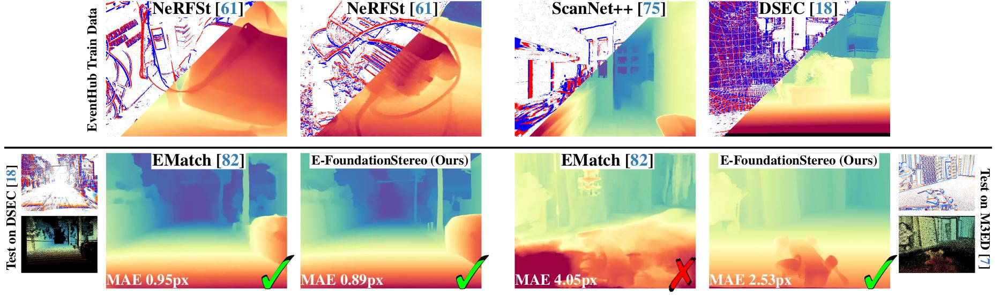
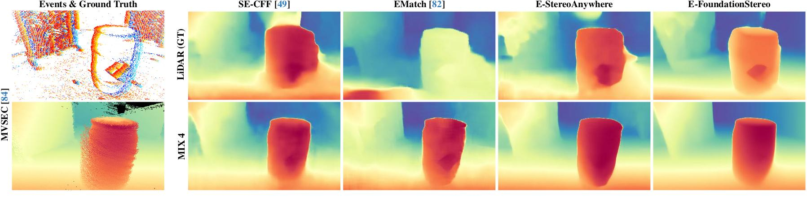
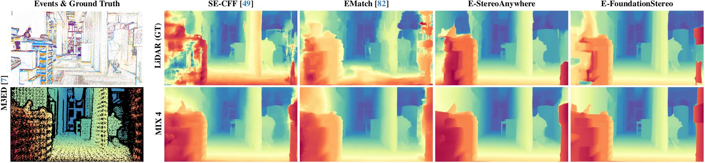

<h1 align="center" style="border-bottom: 0;"> EventHub: Data Factory for Generalizable Event-Based Stereo Networks without Active Sensors</h1>

<h3 align="center"> <b>CVPR 2026</b> </h3>

<h3 align="center">
  <a href="https://bartn8.github.io/">Luca Bartolomei</a><sup>1,2,3</sup> · 
  <a href="https://fabiotosi92.github.io/">Fabio Tosi</a><sup>2</sup> · 
  <a href="https://mattpoggi.github.io/">Matteo Poggi</a><sup>1,2</sup> · 
  <a href="https://stefanomattoccia.github.io/">Stefano Mattoccia</a><sup>1,2</sup> · 
  <a href="https://www.digital-future.berlin/en/about-us/professors/prof-dr-guillermo-gallego">Guillermo Gallego</a><sup>3</sup>
</h3>

<h3 align="center">
  <sup>1</sup> Advanced Research Center on Electronic System (ARCES), University of Bologna, Italy<br>
  <sup>2</sup> Department of Computer Science and Engineering (DISI), University of Bologna, Italy<br>
  <sup>3</sup> TU Berlin, Robotics Institute, Einstein Center Digital Future, SCIoI Excellence Cluster, Germany
</h3>

<h3 align="center">
  <a href="https://arxiv.org/abs/2604.02331">[Paper]</a> | 
  <a href="https://bartn8.github.io/eventhub/">[Project Page]</a>
</h3>

<hr>

<div align="center">
  
</div>

<p align="center"><strong>EventHub Overview.</strong> Our framework combines novel view synthesis for synthetic data generation with cross-modal distillation from RGB stereo foundation models to create high-quality training data for event-based stereo networks without ground-truth LiDAR annotations.</p>

---

## 📋 Table of Contents

- [📋 Table of Contents](#-table-of-contents)
- [🎬 Introduction](#-introduction)
- [📊 Method Overview](#-method-overview)
- [✨ Qualitative Results](#-qualitative-results)
- [🛠 Setup](#-setup)
- [📦 Datasets](#-datasets)
- [🏋️ Training & Evaluation](#️-training--evaluation)
- [📚 Citation](#-citation)
- [📧 Contact](#-contact)
- [🙏 Acknowledgements](#-acknowledgements)

---

## 🎬 Introduction

_We propose EventHub, a novel framework for training deep-event stereo networks without ground truth annotations from costly active sensors, relying instead on standard color images. From these images, we derive either proxy annotations and proxy events through state-of-the-art novel view synthesis techniques, or simply proxy annotations when images are already paired with event data. Using the training set generated by our data factory, we repurpose state-of-the-art stereo models from RGB literature to process event data, obtaining new event stereo models with unprecedented generalization capabilities. Experiments on widely used event stereo datasets support the effectiveness of EventHub and show how the same data distillation mechanism can improve the accuracy of RGB stereo foundation models in challenging conditions such as nighttime scenes._

---

## 📊 Method Overview

### 1. Event Data Factory via Novel View Synthesis

For datasets with only RGB images, we employ a novel pipeline leveraging SVRaster:

- **Image Capture & Calibration**: Multi-view RGB images with camera calibration via COLMAP
- **Regularized Dense 3D Optimization**: Fast training with normal consistency and Depth Anything V2 priors
- **Virtual Trajectory Construction**: Smooth camera trajectories exploring the reconstructed 3D scene
- **Motion-Adaptive Stereo Rendering**: Dynamic rendering framerate based on optical flow to generate high-quality event streams

### 2. Cross-Modal Distillation from RGB Stereo

When calibrated RGB-Event stereo pairs are available:

- Leverage pre-trained RGB stereo foundation models for depth estimation
- Reproject and align predictions to create proxy annotations for event data
- Eliminate the need for expensive LiDAR annotations

### 3. Adapting RGB Stereo Models to Events

- Employ event representations such as Tencode compatible with RGB stereo architectures
- Fine-tune pre-trained RGB stereo networks on event domain data


---

## ✨ Qualitative Results

<div align="center">
  
</div>

<p align="center"><strong>Generalization to MVSEC Dataset.</strong> Zero-shot generalization demonstrating how models trained on EventHub data transfer effectively to unseen datasets with diverse motion patterns and camera setups.</p>

<div align="center">
  
</div>

<p align="center"><strong>Generalization to M3ED Dataset.</strong> Results on challenging scenarios including nighttime operation, dynamic objects, and rapid motion, showing impressive generalization capabilities.</p>

---

## 🛠 Setup

### 1. Clone and initialize the repository

```bash
git clone https://github.com/bartn8/eventhub.git
cd eventhub

# Initialize submodules
git submodule update --init --recursive

# Apply SVRaster patch (adds AO/sizeconf rendering, ESIM event simulation)
cd svraster
git apply ../eventhub_svraster.patch
cd ..

# Apply FoundationStereo patch (adds core_eventhub with LoRA + Depth Anything V2)
cd FoundationStereo
cp -r core core_original
git apply ../eventhub_foundationstereo.patch
mv core core_eventhub
mv core_original core
cd ..
```

### 2. Create the conda environment

```bash
bash create_env.sh
conda activate eventhub
```

This installs PyTorch 2.10.0+cu128, CUDA toolkit 12.8.1, and all required packages. The CUDA architectures default to `80;90` (A100, H100) — edit `create_env.sh` if using different GPUs.

### 3. Build CUDA extensions

```bash
# SVRaster sparse voxel rasterizer
cd svraster
pip install -e cuda/
cd ..

# (Optional) Deformable convolution for the baseline stereo network. Not used since are replaced by the internal PyTorch implementation
# cd event-stereo/src/components/models/baseline/deform_conv
# TORCH_CUDA_ARCH_LIST="8.0;9.0" pip install . --no-build-isolation
```

---

## 📦 Datasets

### Novel View Synthesis Data

These datasets provide the RGB imagery used to train SVRaster for scene reconstruction and novel view synthesis.

#### NerfStereo Dataset

The [NerfStereo](https://amsacta.unibo.it/id/eprint/7218/) dataset provides multi-view RGB captures of object-centric environments. Before use, images must be **undistorted** using the preprocessing script:

```bash
# For each NerfStereo scene, run:
python preprocessing/convert-nerf-stereo.py \
    --source_path <path_to_scene> \
    --camera OPENCV
```

This runs COLMAP image undistortion (requires `colmap` on your PATH) and produces rectified images in `<scene>/images/` along with the sparse reconstruction in `<scene>/sparse/0/`.

**Expected directory structure per scene:**
```
<scene>/
├── images/              # RGB images (input)
├── poses/
│   └── colmap_sparse/0/ # COLMAP sparse reconstruction
└── sparse/0/            # (created by preprocessing)
```

#### ScanNet++ Dataset

Download from the [official ScanNet++ website](https://scannetpp.mlsg.cit.tum.de/scannetpp/). For each scene, the following files are needed:

```
data/<scene_id>/
├── scans/
│   └── mesh_aligned_0.05.ply            # High-quality mesh (for geometry-based rendering)
└── dslr/
    ├── resized_undistorted_images/      # Rectified RGB images
    ├── resized_undistorted_masks/       # Rectified masks
    ├── colmap/                          # COLMAP reconstruction
    └── nerfstudio/                      # NeRFstudio format (optional)
```

### Data Factory: Generating the EventHub Dataset from Scratch

The full pipeline to create synthetic event-stereo training data:

#### Step 1 — SVRaster Scene Optimization

Train a SVRaster model per scene to enable novel view synthesis:

**NerfStereo:**
```bash
export CODEBASE_PATH=$(pwd)/svraster
export DATASET_PATH=<path_to_nerfstereo_root>
export OUTPUT_PATH=<path_to_svraster_outputs>

bash scripts/svraster_train_nsd.sh
```

This iterates over all scenes in `DATASET_PATH` and trains SVRaster with `--res_downscale 2`, normal consistency loss, and Depth Anything V2 priors. Outputs are saved to `OUTPUT_PATH/<scene_id>/`.

**ScanNet++:**
```bash
export CODEBASE_PATH=$(pwd)/svraster
export DATASET_PATH=<path_to_scannetpp_root>
export OUTPUT_PATH=<path_to_svraster_outputs>

bash scripts/svraster_train_scannet.sh
```

Uses full resolution (`--res_downscale 1`) with the ScanNet++ config preset.

#### Step 2 — Novel View Synthesis and Event Extraction

Render virtual stereo trajectories through the trained SVRaster models and synthesize events:

**NerfStereo:**
```bash
export CODEBASE_PATH=$(pwd)/svraster
export DATASET_PATH=<path_to_svraster_outputs>     # From Step 1
export OUTPUT_PATH=<path_to_rendered_dataset>

bash scripts/extract_events_nsd.sh
```

**ScanNet++:**
```bash
export CODEBASE_PATH=$(pwd)/svraster
export DATASET_PATH=<path_to_svraster_outputs>     # From Step 1
export DATASET_MESH_PATH=<path_to_scannetpp_root>   # For mesh-based collision checking
export OUTPUT_PATH=<path_to_rendered_dataset>

bash scripts/extract_events_scannet.sh
```

These scripts:
- Sample virtual stereo trajectories from parameterized curves (`h` horizontal, `v` vertical, `z` zoom)
- Render left/center/right views with color, depth, AO, size-confidence, alpha, and event streams via ESIM simulation
- Randomize baselines, durations, contrast thresholds, and sensor noise for dataset diversity
- Output the final dataset in the format expected by `event-stereo/src/components/datasets/nsd/`

The trajectory configurations are in `configs/param_traj/` and `configs/traj/`.

### Pre-Rendered EventHub Dataset (NerfStereo)

For convenience, our pre-rendered EventHub dataset generated from NerfStereo is available on Hugging Face:

[🤗 EventHubDataset on Hugging Face](https://huggingface.co/datasets/bartn8/EventHubDataset)

```bash
# Install huggingface_hub if needed
pip install huggingface_hub

# Download only the ev-nerfstereo-dataset-GEN3X2 folder
huggingface-cli download bartn8/EventHubDataset \
    --local-dir event-stereo/datasets/ev-nerfstereo-dataset-GEN3X2 \
    --repo-type dataset \
    --include "ev-nerfstereo-dataset-GEN3X2/*"
```

> **Note:** The ScanNet++ portion of the EventHub dataset cannot be distributed directly due to unresolved license terms. Use the pipeline above to generate it yourself from the original ScanNet++ data.

### Third-Party Evaluation & Training Datasets

#### DSEC (Event Stereo)

Download [DSEC](https://dsec.ifi.uzh.ch/) and place it at `event-stereo/datasets/dsec/`.

**Generating proxy disparity labels** via cross-modal distillation from FoundationStereo:

You can run `FoundationStereo/scripts/pseudo_labels_dsec.py` directly on a DSEC sequence to generate disparity maps from left and right RGB images:

```bash
# Requires FoundationStereo pretrained weights (download separately)
python FoundationStereo/scripts/pseudo_labels_dsec.py \
    --left_path event-stereo/datasets/dsec/<sequence>/events_left/rectified/ \
    --right_path event-stereo/datasets/dsec/<sequence>/events_right/rectified/ \
    --output_path event-stereo/datasets/dsec/<sequence>/disparity/proxy_event/ \
    --checkpoint path/to/foundationstereo/weights.pth
```

Then run the alignment script that warp disparity values from rgb camera frame to event camera frame:

```bash
# Requires FoundationStereo pretrained weights (download separately)
python event-stereo/src/dsec_preproc_proxy.py \
    event-stereo/datasets/dsec/<sequence> \
    --min_depth 0.5 --max_depth 100.0
```

This processes each DSEC sequence, running FoundationStereo on the rectified frame images to produce proxy disparity annotations in `<sequence>/disparity/proxy_event/`. Set `disparity_cfg.NAME` to `proxysupervised` in the training config to use these labels (MIX 3).

Alternatively, download our **precomputed proxy labels**:

```bash
# Download from Hugging Face
wget https://huggingface.co/datasets/bartn8/EventHubDataset/resolve/main/dsec_proxy.tar

# Extract into your DSEC directory
tar -xf dsec_proxy.tar -C event-stereo/datasets/dsec/
```

#### M3ED Dataset

**Download:**
```bash
python event-stereo/src/download_m3ed.py \
    --output_dir event-stereo/datasets/M3ED/raw
```

This downloads the subset of M3ED sequences used in our experiments (~150 GB raw data, focusing on indoor, outdoor night, and outdoor day scenarios). Only `data` and `depth_gt` files are downloaded by default.

**Processing (convert to DSEC-compatible format):**
```bash
python event-stereo/src/m3ed_converter.py \
    --input_folder event-stereo/datasets/M3ED/raw \
    --output_folder event-stereo/datasets/M3ED/processed
```

This script:
- Rectifies event and frame cameras using the provided calibration
- Converts LiDAR depth to disparity maps in the event camera's rectified coordinate frame
- Produces per-sequence directories with `events/left/`, `events/right/`, `disparity/event/`, and `calibration/`

#### MVSEC Dataset

Download MVSEC data and calibration files from the [MVSEC website](https://daniilidis-group.github.io/mvsec/):

- [MVSEC dataset folder](https://drive.google.com/drive/folders/1rwyRk26wtWeRgrAx_fgPc-ubUzTFThkV)
- [MVSEC calibration files](https://drive.google.com/file/d/1YgegEo3f3S1Bj-wN77tmiYTPh5qmBt4C/view?usp=sharing)

Place the calibration files inside each MVSEC sequence directory.

#### Dataset Directory Layout

After setup, `event-stereo/datasets/` should look like:

```
event-stereo/datasets/
├── dsec/                          # DSEC with proxy annotations
│   ├── zurich_city_00_a/
│   │   ├── calibration/
│   │   ├── events/left/ events/right/
│   │   └── disparity/
│   │       ├── event/              # Original LiDAR labels
│   │       └── proxy_event/        # Our proxy labels
│   └── ...
├── ev-nerfstereo-dataset-GEN3X2/  # Pre-rendered EventHub (NerfStereo)
│   └── ...
├── M3ED/
│   ├── raw/                       # Raw downloaded files
│   └── processed/                 # Converted to DSEC format
│       └── ...
└── mvsec/                         # MVSEC with calibration files
    └── ...
```

---

## 🏋️ Training & Evaluation

### Pretrained Models

Download our pretrained weights:

[📦 trainings.tar](https://drive.google.com/file/d/1uyBk5cjd9_pnGLMzVPK9bdPqwGLhLDUG/view?usp=sharing)

```bash
tar -xf trainings.tar -C event-stereo/
```

This populates `event-stereo/trainings/` with the trained checkpoints for all configurations (baseline / FoundationStereo / StereoAnywhere × mix1–mix4 × lidar_gt).

### Training

From the `event-stereo/` directory:

```bash
# Example: Train FoundationStereo on mix1 with Tencode event representation
python src/main.py \
    --config_path configs/train/foundationstereo/mix1/config_tencode.yaml \
    --save_root trainings/mix1/tencode/foundationstereo \
    --validate \
    --data_root_validation datasets/dsec \
    --pretrain_path weights/foundationstereo_vits.pth

# Resume from checkpoint
python src/main.py \
    --config_path configs/train/foundationstereo/mix1/config_tencode.yaml \
    --save_root trainings/mix1/tencode/foundationstereo \
    --resume
```

Training scripts for all configurations are available at `scripts/train/{mix1,mix2,mix3,mix4,lidar_gt}/run_train_{baseline,foundationstereo,stereoanywhere}.sh`.

**Key config sections** (YACS-based, in `configs/train/`):
- `MODEL.backbone`: `"FoundationStereo"`, `"StereoAnywhere"`, or `StereoMatchingNetwork` (baseline)
- `MODEL.PARAMS.skip_concentration_net`: `True` for Tencode (3-channel), `False` for multi-bin event stacks
- `DATASET.TRAIN.NAME`: typically `nsd` (EventHub data, MIX 1)
- `DATASET.TEST.NAME`: typically `dsec` for validation

### Evaluation

```bash
# Single model evaluation
python src/inference.py \
    --test_config configs/test/dsec/config_tencode.yaml \
    --data_root datasets/dsec \
    --checkpoint_path trainings/mix1/tencode/foundationstereo/weights/final.pth \
    --save_root tmp \
    --split validation

# Run all evaluations for a dataset
bash scripts/test/run_test_dsec.sh
bash scripts/test/run_test_mvsec.sh
bash scripts/test/run_test_m3ed.sh
```

Results are logged to `results/<dataset>/val/<mix>/<er>_<model>.txt`.

---

## 📚 Citation

```bibtex
@InProceedings{Bartolomei_2026_CVPR,
    author    = {Bartolomei, Luca and Tosi, Fabio and Poggi, Matteo and Mattoccia, Stefano and Gallego, Guillermo},
    title     = {{EventHub}: Data Factory for Generalizable Event-Based Stereo Networks without Active Sensors},
    booktitle = {Proceedings of the IEEE/CVF Conference on Computer Vision and Pattern Recognition (CVPR)},
    year      = {2026}
}
```

---

## 📧 Contact

For questions or inquiries about EventHub, please contact:
- **Luca Bartolomei**: [luca.bartolomei5@unibo.it](mailto:luca.bartolomei5@unibo.it)

---

## 🙏 Acknowledgements

We would like to thank the authors of the following projects for making their code and models available:

- [SE-CFF](https://github.com/yonseivnl/se-cff) for the initial event-stereo codebase upon which our training framework is built
- [SVRaster](https://svraster.github.io/) for efficient novel view synthesis
- [FoundationStereo](https://nvlabs.github.io/FoundationStereo/) for state-of-the-art RGB stereo matching
- [StereoAnywhere](https://stereoanywhere.github.io/) for robust zero-shot depth estimation
- [Depth Anything V2](https://github.com/DepthAnything/Depth-Anything-V2) for monocular depth priors
- [COLMAP](https://colmap.github.io/) for structure-from-motion
- [DSEC](https://dsec.ifi.uzh.ch/), [MVSEC](https://daniilidis-group.github.io/mvsec/), and [M3ED](https://github.com/JingyeDeng/M3ED) datasets for evaluation
